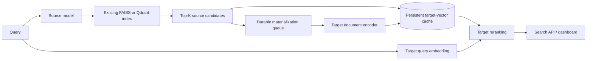
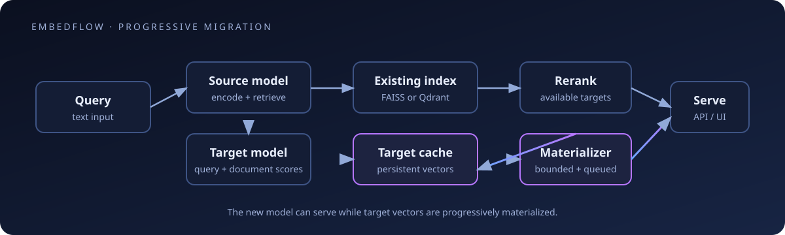
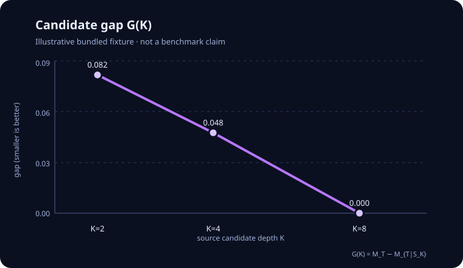

# EmbedFlow

**Upgrade embedding models without requiring a full upfront re-index.**

EmbedFlow is an open-source research and early real-world experimentation
toolkit for progressive embedding-model migration. It keeps a legacy vector index online,
uses it to propose a bounded candidate set, scores those candidates with a
new model, and materializes target document vectors progressively in a
persistent cache.

It is deliberately honest about what it can and cannot establish. A
`SAFE` result from the frozen T2-v1 diagnostic is an empirical finite-tail
signal—not a compatibility guarantee. ANN fidelity is reported separately and
is `UNKNOWN` unless an exact/reference comparison is supplied.

Small release visuals are collected in [`docs/assets/`](docs/assets/), including
an architecture diagram, an illustrative candidate-gap curve, and a
reproducible terminal still.





The bundled candidate-gap graphic is deliberately labelled illustrative; it is
not a claim about a production corpus:



## Why this exists

Different embedding models use different representation spaces. That does not
necessarily mean their retrieval neighborhoods are incompatible. The research
question is whether a target model can recover useful retrieval quality from
the source model's candidate pool before a native target index exists.

For candidate depth `K`, the research defines:

```text
G(K) = M_T - M_{T|S_K}
```

where `M_T` is native target retrieval quality and `M_{T|S_K}` is target
quality restricted to source top-`K` candidates. Candidate containment is a
separate metric. Do not substitute containment for candidate gap.

## Known migration evidence

EmbedFlow ships a small, versioned **core registry** built only from retained
research tables. It includes the BRIGHT frozen four-domain analysis, the
Natural Questions 100K/250K/500K/1M scale curves, the frozen T2-v1 holdout
summary, and separately labelled measured serving/model profiles. It contains
no embeddings, indexes, model weights, or private datasets.

```bash
embedflow registry list
embedflow registry show --source Qwen/Qwen3-Embedding-4B --target Qwen/Qwen3-Embedding-8B
embedflow registry match --config ./embedflow.yaml
embedflow registry verify
embedflow benchmark-profiles list
```

Matching is deliberately conservative:

- **EXACT REGISTRY MATCH** means the source and target contracts and canonical
  corpus construction match. Canonical values can be reused with
  `analyze --use-registry`.
- **PRIOR EVIDENCE AVAILABLE** means the exact contracts were studied on a
  different corpus. The values inform probe depths but do not certify the new
  corpus or produce a `SAFE` decision.
- **RELATED EVIDENCE ONLY** means a model family or display name is related but
  the full contract differs (revision, prompt, pooling, length, or
  normalization). It is never an automatic compatibility decision.

See [`docs/registry.md`](docs/registry.md) for the schema, provenance policy,
and contribution workflow.

## Install

The lightweight install contains configuration, deterministic demo models, and
the NumPy fallback. Add only the integrations you need:

```bash
python -m venv .venv
. .venv/bin/activate
python -m pip install -e ".[faiss,dashboard]"
```

If you prefer conventional requirements files, the same portable base is
available as:

```bash
python -m pip install -r requirements.txt
python -m pip install -e .
```

For development and tests:

```bash
python -m pip install -r requirements-dev.txt
python -m pip install -e .
```

FAISS, Qdrant, dashboard, and model runtimes remain optional extras so a
stranger can install the CPU-only core without downloading GPU libraries or
model weights. See the extras below for those integrations.

For a GitHub checkout before a PyPI publication, use
`python -m pip install 'git+https://github.com/arnsri33/embedflow.git'`.

For real Hugging Face models:

```bash
python -m pip install -e ".[faiss,dashboard,models]"
```

Qdrant support is optional:

```bash
python -m pip install -e ".[qdrant,dashboard]"
```

The release gate itself is portable and does not assume a particular checkout
layout. Run it from the repository root with:

```bash
python scripts/release_gate.py
```

It validates the packaged registry without external files. Maintainers who
have retained research artifacts and local model snapshots can opt into the
additional checks with `EMBEDFLOW_PROVENANCE_ROOT` (the base for registry
artifact identifiers), `EMBEDFLOW_RESEARCH_ROOT` (a checkout containing the
research regression tests), and `EMBEDFLOW_MODEL_ROOT` (a directory containing
the local model snapshots expected by `scripts/real_qdrant_smoke.py`). No
machine-specific paths are required for ordinary users.

## Quickstart: deterministic demo

No paid service or model download is required:

```bash
./scripts/run_demo.sh
```

Open <http://127.0.0.1:8000/> and search `what explains auroras?` twice.
The first request is `COLD` or `PARTIAL`; later requests become `WARM` as the
background materializer fills the SQLite cache.

For a setup-only run:

```bash
./scripts/run_demo.sh --no-serve
```

The optional `real-demo --corpus topics --download` command uses the pinned
MiniLM → Qwen3-0.6B contracts and downloads public model weights on demand;
weights are never bundled. The default deterministic demo is the supported
offline smoke test.

## Mode B: analyze and serve without a target index

This is the operational migration workflow. You have a source model, target
model, existing source index, document lookup, and unlabeled probe queries.
You do not need qrels or a native target index.

The direct command creates a reusable analysis config and runs the frozen
finite-tail probe:

```bash
embedflow analyze \
  --documents ./documents.jsonl \
  --index ./legacy.index \
  --source-model sentence-transformers/all-MiniLM-L6-v2 \
  --target-model Qwen/Qwen3-Embedding-0.6B \
  --probe-queries ./probe_queries.jsonl \
  --model-root ./models \
  --device cuda \
  --output-dir ./analysis
```

The report contains:

- T2-v1: `SAFE`, `EXPAND`, or `UNSAFE_OR_UNCERTAIN`;
- a **recommended initial candidate depth**, not `K*`;
- explicit ANN status (`UNKNOWN` without a reference comparison);
- the warning that the diagnostic is empirical, not a guarantee.

Then start progressive serving:

```bash
embedflow serve --config ./analysis/embedflow.analysis.yaml --device cuda
```

Or use the one-command facade from Python:

```python
import embedflow

session = embedflow.migrate(
    index="./legacy.index",
    old_model="sentence-transformers/all-MiniLM-L6-v2",
    new_model="Qwen/Qwen3-Embedding-0.6B",
    documents="./documents.jsonl",
    model_root="./models",
    device="cuda",
    candidate_depth=50,
    cache_path="./embedflow_cache",
)
print(session.search("what causes auroras?", top_k=10))
```

The search response reports `COLD`, `PARTIAL`, or `WARM`, along with cache
hits, misses, synchronous encodes, asynchronous queueing, and per-stage
latency. `max_sync_misses` bounds request-time target document work; remaining
misses go to the durable retrying worker.

`embedflow status` reports cached target vectors, corpus coverage, cumulative
hits/misses, recent hit rate, queue state, and materialization throughput. The
SQLite cache is keyed by `(document_id, target_model_fingerprint)` and checks
dimensions, dtype, and a checksum on every read.

## Mode A: research evaluation

When qrels and native target evidence are available, evaluate candidate gap
directly:

```bash
embedflow evaluate \
  --config ./experiment.yaml \
  --queries ./queries.jsonl \
  --qrels ./qrels.json \
  --native-target-index ./target.index \
  --reference-index ./exact-source.index \
  --k-values 10,20,50,100,200,500 \
  --epsilon 0.01 \
  --bootstrap 10000 \
  --output-dir ./results
```

This writes `results.json`, `results.csv`, `candidate_gap_curve.csv`,
`containment_curve.csv`, and `report.md`. `results.csv` is a one-row summary;
the two curve files contain the per-`K` measurements. If a native target index is not
provided, the target model is encoded over the corpus in-process; that is
correct but can be expensive. Saved native target rankings are also accepted
with `--native-target-rankings` (one JSON object per line with `id` and
`ranked_ids`).

`K*_epsilon` is only reported in this Mode A workflow. In Mode B, T2-v1 can
recommend an initial depth from finite-tail behavior, but it cannot observe
native target quality and therefore cannot identify `K*`.

## Configuration

```yaml
source:
  model: sentence-transformers/all-MiniLM-L6-v2
  device: cuda

target:
  model: Qwen/Qwen3-Embedding-0.6B
  device: cuda

index:
  backend: faiss
  path: ./legacy.index
  metric: cosine
  # For Qdrant only: collection, url, vector_name, api_key_env

documents:
  path: ./documents.jsonl
  id_field: id
  text_field: text

probe:
  queries: ./probe_queries.jsonl
  k_values: [10, 20, 50, 100, 200, 500]
  kmax: 500
  epsilon: 0.01

migration:
  candidate_depth: auto
  max_sync_misses: 4
  background_batch_size: 32

cache:
  path: ./embedflow_cache

telemetry:
  latency_log: ./logs/latency.jsonl

economics:
  gpu_price_per_hour: null
  target_docs_per_second: null
```

Relative paths are resolved against the YAML file. Model fingerprints include
the model revision, dimension, pooling, prompts, padding, truncation,
normalization, and dtype. `source.device` / `target.device` are used when the
CLI `--device` override is omitted. Local paths and devices are intentionally excluded
so a cache/index can move between machines without changing its semantic
contract.

For container deployments, a small set of environment overrides is supported:
`EMBEDFLOW_SOURCE_MODEL`, `EMBEDFLOW_TARGET_MODEL`,
`EMBEDFLOW_SOURCE_DEVICE`, `EMBEDFLOW_TARGET_DEVICE`, `EMBEDFLOW_INDEX_PATH`,
`EMBEDFLOW_INDEX_URL`, `EMBEDFLOW_INDEX_COLLECTION`,
`EMBEDFLOW_INDEX_VECTOR_NAME`, `EMBEDFLOW_QDRANT_API_KEY_ENV`,
`EMBEDFLOW_INDEX_NPROBE`,
`EMBEDFLOW_DOCUMENTS_PATH`, `EMBEDFLOW_CACHE_PATH`, `EMBEDFLOW_STATE_PATH`,
`EMBEDFLOW_LATENCY_LOG`, `EMBEDFLOW_CANDIDATE_DEPTH`,
`EMBEDFLOW_MAX_SYNC_MISSES`, `EMBEDFLOW_BACKGROUND_BATCH_SIZE`, and
`EMBEDFLOW_PROBE_KMAX`. Unset variables do not alter the YAML configuration.

## FAISS and Qdrant

FAISS is the default backend and requires an ID sidecar next to the index:
`legacy.index.ids.json` (or the configured `index.ids` path). The document
store must contain every ID referenced by the index.

Qdrant is optional and supports local Qdrant storage or a user-owned server:

```yaml
index:
  backend: qdrant
  url: http://localhost:6333
  collection: my_legacy_collection
  metric: cosine
  # vector_name: text  # only for named-vector collections
  # api_key_env: QDRANT_API_KEY
```

For a cloud deployment, set the configured environment variable (by default
`QDRANT_API_KEY`) before starting EmbedFlow. The adapter reads the key only at
connection time; credentials are never written to YAML or committed here. The
adapter preserves arbitrary application document IDs using a deterministic UUID
mapping. See
[`examples/qdrant/`](examples/qdrant/README.md).

When locally staged research snapshots are available, the release smoke test
also exercises the real MiniLM → Qwen3-0.6B path against a persistent local
Qdrant collection. It is a functional lifecycle check, not a benchmark:

```bash
python scripts/real_qdrant_smoke.py --model-root ./models
```

The script expects `models/minilm_l6/` and `models/qwen3_0_6b/`; model weights
are intentionally not shipped in this repository.

The stable `VectorIndex` interface is the extension point for Pinecone,
Weaviate, pgvector, Milvus, or OpenSearch. See
[`CONTRIBUTING.md`](CONTRIBUTING.md).

## CLI and API

```bash
embedflow init
embedflow analyze --help
embedflow evaluate --help
embedflow serve --config ./embedflow.yaml
embedflow search --config ./embedflow.yaml "what causes auroras?"
embedflow status --config ./embedflow.yaml
embedflow prewarm --config ./embedflow.yaml --documents 10000 --async
embedflow audit-index --config ./embedflow.yaml
embedflow economics --corpus-size 1000000000 --docs-per-second 106.98 --gpu-price 3.29
embedflow export-target --config ./embedflow.yaml --output-index ./target.index
embedflow doctor --config ./embedflow.yaml
embedflow registry list
embedflow registry match --config ./embedflow.yaml
```

The FastAPI application exposes `/health`, `/status`, `/plan`, `/analyze`,
`/search`, `/prewarm`, `/metrics`, and `/economics`, with automatic OpenAPI
documentation at `/docs` when the dashboard extra is installed.

`POST /search` accepts `{"query": "what causes auroras?", "top_k": 10}` and
returns the nested migration details plus convenient top-level fields such as
`state`, `candidate_depth`, `cache_hits`, `cache_misses`, and
`async_queued`. `PARTIAL` means only the currently cached target vectors were
scored; it is not identical to a fully warm target rerank.

## Economics

```bash
embedflow economics \
  --corpus-size 1000000000 \
  --docs-per-second 106.98 \
  --gpu-price 3.29
```

The result is explicitly labelled a projection based on supplied measured
throughput. It is not a hardware guarantee, lifetime-savings claim, or
universal H100 benchmark.

## Research and limitations

Read [`docs/concepts.md`](docs/concepts.md) and
[`docs/methodology.md`](docs/methodology.md) for the definitions of candidate
gap, containment, observed migration depth, T2-v1, and ANN decomposition.

The public release does not claim production proof, universal zero downtime,
elimination of all re-embedding, guaranteed cost reduction, or universal
latency. The included dashboard and deterministic demo are functional
examples, not a benchmark. Latency is workload- and hardware-dependent.

The related research reports 63 source-target migration settings, retrieval
experiments up to 1M documents, and a separate retained 25K-document serving
benchmark. The latency artifact does not preserve GPU identity, so this
repository does not relabel it as an H100 result. These are research
measurements, not claims that this repository has tested every configuration or
a live 1B-document deployment.

## Research citation

The paper is *EmbedFlow: Upgrading Legacy Embeddings Without Full Upfront
Re-Embedding*. The public paper URL is currently **coming soon**; the project
makes no conference-acceptance claim.

## License and status

EmbedFlow is released under the Apache-2.0 license. Copyright 2026 Arnav
Srivastav. This release is `v0.1.0`, alpha-quality infrastructure for serious
experimentation and early real-world validation.

See [`CHANGELOG.md`](CHANGELOG.md), [`CONTRIBUTING.md`](CONTRIBUTING.md), and
[`SECURITY.md`](SECURITY.md).
