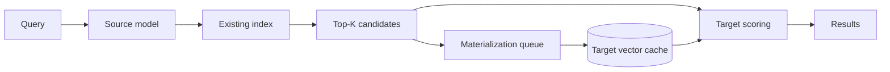

# EmbedFlow

**Progressive embedding-model migration over existing vector indexes.**

🌐 **Website:** [embedflow.org](https://embedflow.org)

EmbedFlow lets a new embedding model serve over candidates from an existing
vector index while target document vectors are materialized progressively. It
supports migration analysis, persistent caching, background work, and serving
through FAISS, Qdrant, a CLI, and FastAPI.

[Quickstart](#try-it) · [Documentation](#documentation) · [Research](#research)

## Why EmbedFlow?

Embedding-model upgrades usually mean re-embedding the corpus and building a
second index before the new model can serve. EmbedFlow tests whether the
existing retriever can remain useful during that transition.

The core observation is simple:

> Different representation spaces can still preserve useful retrieval
> neighborhoods.



Measured candidate gap from the registry:


## Install

Install the published package from PyPI:

```bash
python -m pip install embedflow
```

For FAISS and the dashboard, add the optional integrations:

```bash
python -m pip install "embedflow[faiss,dashboard]"
```

Qdrant and model-runtime extras are documented in
[`docs/installation.md`](https://github.com/arnsri33/embedflow/blob/main/docs/installation.md).
For model-backed analysis, install `embedflow[faiss,models,dashboard]`.

## Try it

The deterministic demo needs no paid service or model download:
install the FAISS/dashboard variant above to use its browser UI.

```bash
embedflow demo
```

Open <http://127.0.0.1:8000/>. The first search can be `COLD` or `PARTIAL`;
repeated traffic becomes `WARM` as the background materializer fills the
persistent cache.

For a setup-only run, pass `--no-serve`:

```bash
embedflow demo --no-serve
```

The repository also includes `scripts/run_demo.sh` for source-checkout development.

## Analyze a migration

For an existing source index and no native target index, run the finite-tail
analysis first:

```bash
embedflow analyze \
  --documents ./documents.jsonl \
  --index ./legacy.index \
  --source-model sentence-transformers/all-MiniLM-L6-v2 \
  --target-model Qwen/Qwen3-Embedding-0.6B \
  --probe-queries ./probe_queries.jsonl \
  --model-root ./models \
  --device cuda \
  --output-dir ./analysis
```

The report gives a T2-v1 diagnostic (`SAFE`, `EXPAND`, or
`UNSAFE_OR_UNCERTAIN`), a recommended initial candidate depth, and ANN health.
Treat `SAFE` as an empirical deployment signal and validate important
migrations on the target corpus. Use `--device cpu` on a CPU-only machine.

Start progressive serving with the generated configuration:

```bash
embedflow serve --config ./analysis/embedflow.analysis.yaml --device cuda
```

The Python facade is available when an application needs an in-process
session:

```python
import embedflow

session = embedflow.migrate(
    index="./legacy.index",
    old_model="sentence-transformers/all-MiniLM-L6-v2",
    new_model="Qwen/Qwen3-Embedding-0.6B",
    documents="./documents.jsonl",
    model_root="./models",
    device="cuda",
    candidate_depth=50,
    cache_path="./embedflow_cache",
)
results = session.search("what causes auroras?", top_k=10)
```

Search responses expose `COLD`, `PARTIAL`, or `WARM`, cache hits and misses,
synchronous work, queued work, and stage timings. Once the candidate vectors
are warm, target scoring over that candidate set is deterministic.

## Known migration evidence

EmbedFlow ships a versioned core registry of measured results from the research
study. Matching model contracts can provide useful starting depths and show
what was observed on earlier corpora; a new corpus still receives its own
analysis.

```bash
embedflow registry list
embedflow registry show \
  --source Qwen/Qwen3-Embedding-4B \
  --target Qwen/Qwen3-Embedding-8B
embedflow registry match --config ./embedflow.yaml
```

Selected core records (nDCG@10, `G(50)`):

| Source | Target | Evaluation | `G(50)` | Observed depth |
| --- | --- | --- | ---: | ---: |
| MiniLM-L6-v2 | Qwen3-8B | BRIGHT, 413K | 0.03665 | — |
| Qwen3-0.6B | Qwen3-8B | BRIGHT, 413K | 0.01465 | 200 |
| Qwen3-4B | Qwen3-8B | BRIGHT, 413K | 0.00347 | 20 |
| MiniLM-L6-v2 | Qwen3-8B | Natural Questions, 1M | 0.03255 | 500 |
| Qwen3-4B | Qwen3-8B | Natural Questions, 1M | -0.00043 | 20 |

Exact corpus and contract matches can reuse canonical results with
`--use-registry`. Matching contracts on a different corpus are reported as
prior evidence and still trigger current-corpus validation. See
[`docs/registry.md`](https://github.com/arnsri33/embedflow/blob/main/docs/registry.md)
for matching and provenance details.

## Research

For candidate depth `K`, EmbedFlow measures:

```text
G(K) = M_T - M_{T|S_K}
```

Lower `G(K)` means the source candidate pool recovers more of native target
retrieval quality. Containment reports neighborhood overlap separately.
When native target evidence is available, the observed depth is
`K*_epsilon = min { K : G(K) <= epsilon }`. With probe data alone, T2-v1
estimates finite-tail behavior and recommends an initial depth.

The study includes 63 development settings, frozen BRIGHT validation, and
Natural Questions scale experiments through 1M documents. T2-v1 is the frozen
finite-pool diagnostic used before a native target index exists. ANN fidelity
is measured separately and is `UNKNOWN` until an exact reference is supplied.

- [Concepts](https://github.com/arnsri33/embedflow/blob/main/docs/concepts.md)
- [Methodology](https://github.com/arnsri33/embedflow/blob/main/docs/methodology.md)
- [Known evidence registry](https://github.com/arnsri33/embedflow/blob/main/docs/registry.md)
- [Paper: *EmbedFlow: Upgrading Legacy Embeddings Without Full Upfront Re-Embedding*](#citation)

## Integrations

| Backend | Status |
| --- | --- |
| FAISS | Supported |
| Qdrant | Supported |

Backend-specific setup and examples:

- [FAISS](https://github.com/arnsri33/embedflow/blob/main/docs/integrations/faiss.md)
- [Qdrant](https://github.com/arnsri33/embedflow/blob/main/docs/integrations/qdrant.md)
- [Adding a backend](https://github.com/arnsri33/embedflow/blob/main/CONTRIBUTING.md)

## CLI

```bash
embedflow --help
embedflow analyze --help
embedflow serve --config ./embedflow.yaml
embedflow status --config ./embedflow.yaml
embedflow registry list
embedflow economics --corpus-size 1000000000 --docs-per-second 106.98 --gpu-price 3.29
embedflow doctor --config ./embedflow.yaml
```

The full command reference is in
[`docs/cli.md`](https://github.com/arnsri33/embedflow/blob/main/docs/cli.md). The FastAPI
service exposes health, status, search, analysis, prewarming, metrics, and
OpenAPI documentation; see
[`docs/api.md`](https://github.com/arnsri33/embedflow/blob/main/docs/api.md).

## Documentation

- [Installation and extras](https://github.com/arnsri33/embedflow/blob/main/docs/installation.md)
- [Quickstart](https://github.com/arnsri33/embedflow/blob/main/docs/quickstart.md)
- [Configuration](https://github.com/arnsri33/embedflow/blob/main/docs/configuration.md)
- [CLI reference](https://github.com/arnsri33/embedflow/blob/main/docs/cli.md)
- [API](https://github.com/arnsri33/embedflow/blob/main/docs/api.md)
- [Economics](https://github.com/arnsri33/embedflow/blob/main/docs/economics.md)
- [Limitations](https://github.com/arnsri33/embedflow/blob/main/docs/limitations.md)
- [Contributing](https://github.com/arnsri33/embedflow/blob/main/CONTRIBUTING.md)
- [Security](https://github.com/arnsri33/embedflow/blob/main/SECURITY.md)

## Status

EmbedFlow v0.1.0 is an alpha release for research and early real-world
testing.

- T2-v1 reports an empirical finite-tail diagnostic.
- `PARTIAL` rankings can differ from fully warm target reranking.
- ANN fidelity needs a reference comparison to audit.

## Citation

The accompanying paper is *EmbedFlow: Upgrading Legacy Embeddings Without
Full Upfront Re-Embedding*. The public paper URL is coming soon. Citation
metadata is in
[`CITATION.cff`](https://github.com/arnsri33/embedflow/blob/main/CITATION.cff).


## License

Apache-2.0. Copyright 2026 Arnav Srivastav.  
